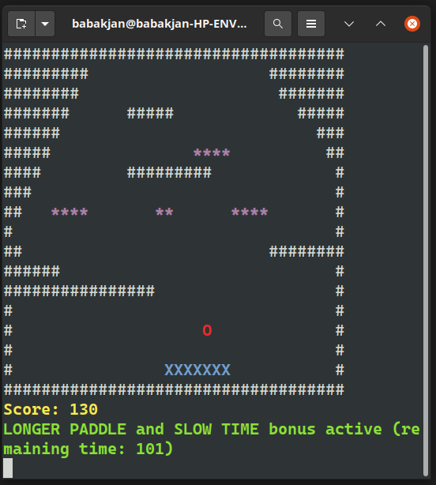

# Arkanoid

Author: Jan Babák

## Task:

Implement basic **action game** for one or more players against computer.

##### requirements:

1. Contains objects, which can be destroyed.
2. Player movement.
3. After object destruction, there will remain bonus with some probability.
4. Loading map from file, saving scores to file...
5. Use polymorphism.

## Arkanoid description:

Arkanoid (also called as breakout) is a 2D game. Game is composed from bricks, ball and paddle. Ball bounces to walls and paddle. If ball touches brick, brick is destoryed. When all bricks are destroyed, player win, when ball falls under paddle level, player lost. Player can move by paddle only to left and right. Speed of ball is slowly increasing. There are bonuses, like paddle width extension, or slowing the game for a while, when brick is destroyed.

## Controls:

- Option 1 - numpad:
  - up: 8 (in menu)
  - down: 2 (in menu)
  - left: 4 (paddle movement)
  - right: 6 (paddle movement)
  - select option (like enter): 5
- Option 2 - "aswd":
  - up: w (in menu)
  - down: s (in menu)
  - left: a (paddle movement)
  - right: d (paddle movement)
  - select option: enter
- pause: p
- quit to main menu: q

## Instalation:

- clone or download this repositoiry
- you need g++ compiler on your pc - game uses c++14 compiler
- start game by writting "make run" into terminal, (must be in cloned directory)
- delete binary "make clean" into terminal, (must be in cloned directory)
- generate documentation "make doc" into terminal, (must be in cloned directory) and need doxygen installed (sudo apt-get install doxygen - for ubuntu), documentation is in /doc folder, just open index.html in your browser
